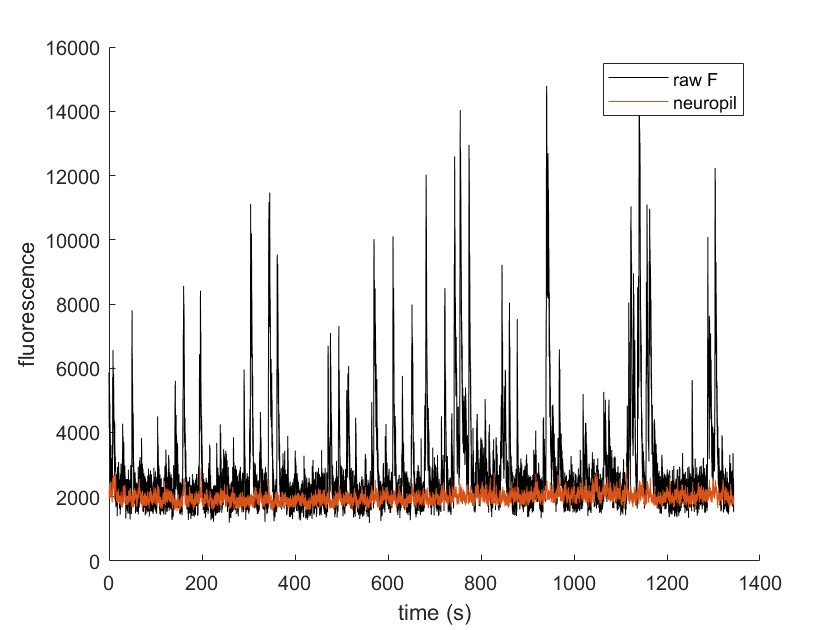
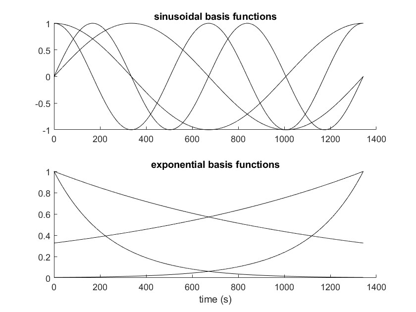
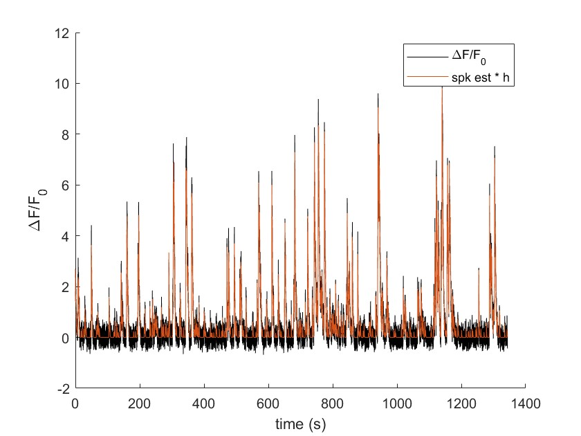

# FINDBN: an integrated iterative algorithm for decomposition of a fluoresence signal into neuropil, baseline, and estimated (deconvolved) activity
This algorithm is implemented in MATLAB.

## Code description
* findbn.m: Given fluoresence trace y and neuropil signal neu, attempts to recover signals by assuming y = spk_est ∗ h + B * coeff, where h is a kernel defined by time constants tau, B is the basis functions, and coeff is the associated constants. Thus spk_est ∗ h (convolution operation) is the estimate of F(t) and B * coeff (matrix multiplication) is the estimate of the baseline. Algorithm iterates between solving for coeff (using lsqlin) and updating spk_est (using oasisAR2).

For convenience, we have included oasisAR2.m, oasisAR1.m, and thresholded_oasisAR2.m from https://github.com/flatironinstitute/CaImAn-MATLAB/tree/master/deconvolution/oasis. These files are needed for findbn to run. However, different spike inference methods can be used in place of Oasis if desired by replacing the appropriate code in the est_spk subroutine in findbn.m.

## Citation
Please cite/reference Issa et al - Nat Neuro 2023.

If Oasis is used, please cite/reference Friedrich et al - PLOS Comp Bio 2017 and/or Giovannucci et al - eLife 2019.

## Example
The following example illustrates the operation of this function. We start with a dataset as follows: time t, raw fluorescence y, and neuropil neu. These are plotted here: plot(t,y,'k'); hold on; plot(t,neu); hold off

Next we use the following parameters: tau = [.6 .1], max_freq = .002, exp_tau = [240 1200], and lam_est = [1/3 1/3]. The code will generate the following basis functions: a single constant function, 4 sinusoidal functions, and 4 exponential functions, along with the neuropil and estimate of true dF/F0 (F_est), to be described later:

Next, we run the algorithm: [coeff,Bfull,Bhist,spk_est] = findbn(t,y,[.6 .1],neu,.002,[240 1200],true,[1/3 1/3]);
Bnpil = Bfull(:,end-1)*coeff(end-1); % scaled neuropil
Bline = Bfull(:,1:end-2)*coeff(1:end-2); % scaled baseline
F_est = (Bfull(:,end)*coeff(end))./Bline; % F-F0 estimate
dF = (y-Bnpil-Bline)./Bline; % dF/F0 estimate
z_norm = spk_est./Bline; % scale the spike estimate

We can then plot the following useful quantities. This shows dF/F0 calculated by subtracting scaled neuropil and the baseline (constructed from a weighted sum of the basis functions) and divided by baseline, represented by dF. Overlaid is F_est, which is the convolution of the inferred spike probabilities z_norm with the Ca2+ kernel definted by tau.

